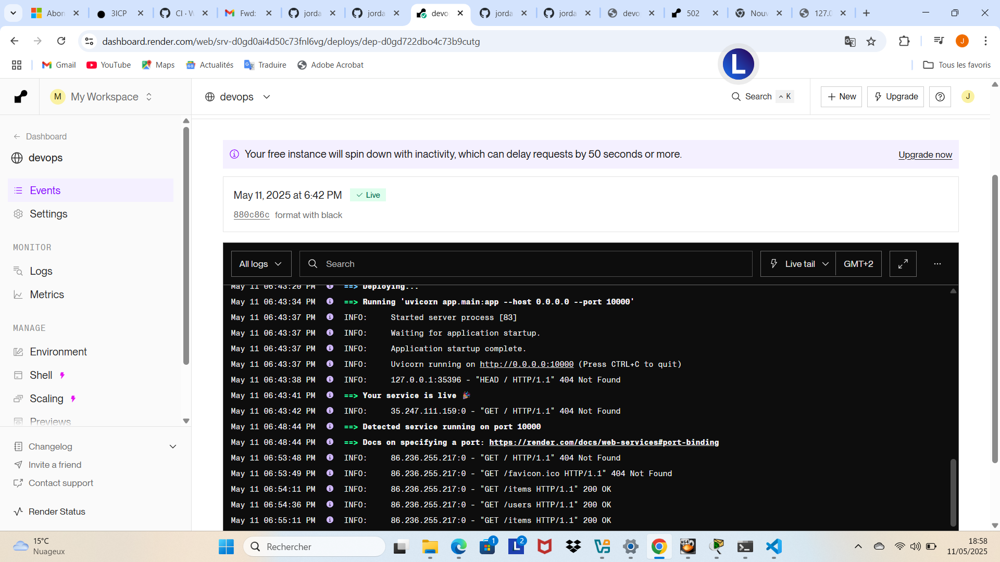
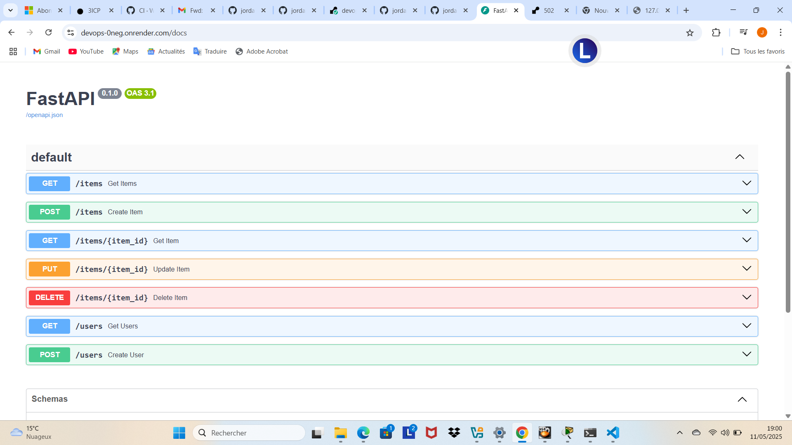

# DEVOPS Item Management API

## 📦 Description

Une API REST construite avec **FastAPI** permettant la gestion de produits (`items`) et d'utilisateurs (`users`).  
Le projet inclut des tests, du linting, une pipeline CI/CD GitHub Actions, et un déploiement automatique sur **Render.com**.

## 🚀 Fonctionnalités

- **GET /items** : Liste tous les items
- **GET /items/{id}** : Affiche un item
- **POST /items** : Crée un item
- **PUT /items/{id}** : Met à jour un item
- **DELETE /items/{id}** : Supprime un item
- **GET /users** : Liste tous les uitlisateur
- **GET /users/{id}** : Affiche un uitlisateur
- **POST /users** : Crée un uitlisateur
- **PUT /users/{id}** : Met à jour un uitlisateur
- **DELETE /users/{id}** : Supprime un uitlisateur
- 🧪 Tests unitaires avec `pytest`
- ✅ Linting avec `flake8`
- 🚀 CI/CD avec **GitHub Actions**
- ☁️ Déploiement automatique via **Render.com**


## 🗂️ Structure du projet
devops/
├── app/
│ ├── main.py
│ ├── models.py
│ └── init.py
├── tests/
│ ├── test_main.py
│ └── init.py
├── .github/workflows/ci.yml
├── requirements.txt
├── .flake8
└── README.md


## Installation

### 1. clonner le projet
```bash
git init
git clone https://github.com/jordancab/devops.git
cd devops
```
### 2. Installer les dépendances
```bash
pip install -r requirements.txt

## 🧪 Tests

Lancer les tests avec :

```bash
pytest
```

###🧹 Lint du code
```bash
flake8 .
```
## 🤖 CI avec GitHub Actions
Chaque push ou pull request déclenche automatiquement :

flake8 (linting)

pytest (tests)

Le pipeline est défini dans .github/workflows/ci.yml.


## 📦 Technologies utilisées

- [FastAPI](https://fastapi.tiangolo.com/)
- [Pydantic](https://pydantic-docs.helpmanual.io/)
- [Uvicorn](https://www.uvicorn.org/)
- [pytest](https://docs.pytest.org/)
- [flake8](https://flake8.pycqa.org/)
- [GitHub Actions](https://github.com/features/actions)
- [Render](https://render.com/)

---

## ☁️ Déploiement sur Render.com
### 1. Préparation
Crée un compte sur Render

Crée un nouveau Web Service

Connecte ton dépôt GitHub

Choisis :

Environment: Python

Build Command: pip install -r requirements.txt

Start Command:

```bash
uvicorn app.main:app --host 0.0.0.0 --port 10000
```



### 2. Résultat
Une fois déployé, tu peux accéder à ton API ici :
https://devops-0neg.onrender.com/items


### Documentation de l'API
https://devops-0neg.onrender.com/docs
